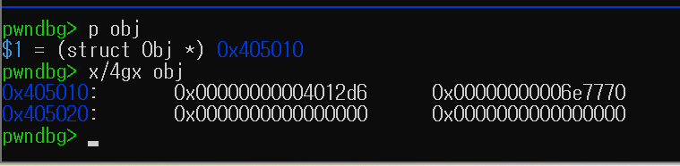
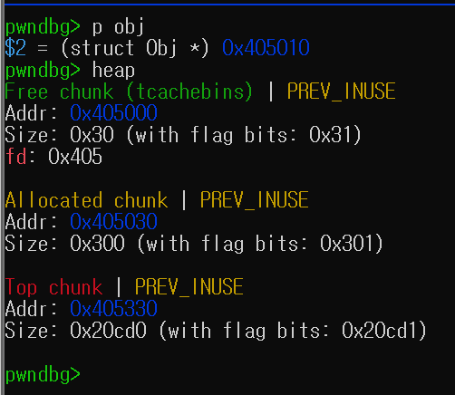
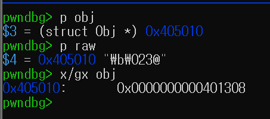
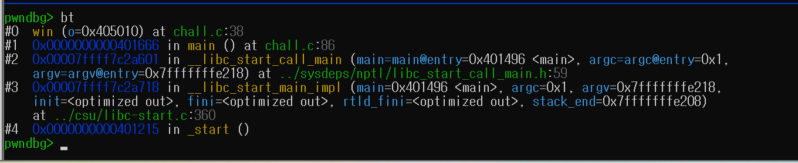
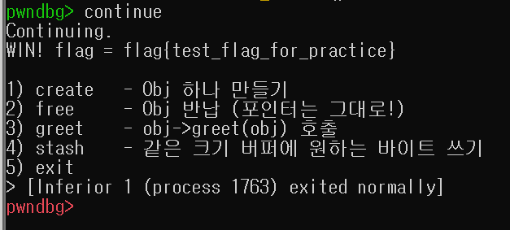

# WHS4 — 리눅스 시스템 해킹 심화 과제 (UAF)

> 멘토: 정상수 · 제출기간: 2026-07-11 23:00 ~ 2026-07-19 23:59
> 구성: **과제1 uaf-lab-kit** (관찰·실습) + **과제2 uaf-ctf** (exploit.py 역분석)

---

## 과제 1 — uaf-lab-kit

작은 C 예제 6개 + `challenge_fixme.c`를 직접 컴파일(gcc, no-ASan / ASan 두 얼굴)하여 실행하고 관찰한 결과입니다.

### 1. 관찰 기록

| # | 파일 | 얼굴 A (no-ASan) — 무엇이 이상해졌나 | 얼굴 B (ASan) — 사고 종류 |
|---|---|---|---|
| 01 | `01_hello_uaf.c` | free 후에도 값을 그대로 읽고 쓴다 | heap-use-after-free |
| 02 | `02_realloc_move.c` | 자리가 확장돼서 주소가 안 바뀐다 | heap-use-after-free |
| 03 | `03_reentrancy.c` | 콜백이 buf를 이동시킨 뒤에도 캐시된 start로 읽어서 이상한 값이 나온다 (0) | heap-use-after-free |
| 04 | `04_dos_vs_leak.c` | A는 필요없는 값, B는 값 그대로 노출된다 | (A가 핵심) |
| 05 | `05_type_confusion.c` | evil_render가 심어져서 호출하면 실행된다 (재점유) | (A가 핵심) |
| 06 | `06_fixed.c` | 바뀐 값이 없어야 정상 | 조용하면 성공 |

### 2. 예측 → 확인

**Q2.1** (예제 02) `cached`와 `p`의 주소는 realloc 후 같을까 다를까?
> 같았습니다. realloc은 무조건 새 주소로 옮기는 게 아니라 뒤에 공간이 있으면 원래 자리에서 그대로 크기만 늘릴 수 있기 때문입니다.

**Q2.2** (예제 04) 케이스 A(재점유 없음)와 케이스 B(재점유)의 '읽힌 값'이 왜 다른가?
> 케이스 A는 아무도 그 메모리를 다시 사용하지 않아서 쓰레기값이 읽혀 DoS인 것이고, 케이스 B는 다른 데이터가 들어가 그 값이 읽혀서 leak입니다.

**Q2.3** (예제 05) UAF로 읽은 것이 '함수 포인터'였다. 그래서 read가 왜 곧 '무엇을 실행할지(제어)'가 되는가?
> 읽은 값이 함수 포인터라서 그 주소가 다음에 실행할 함수를 결정하는 거라, 읽는 것이 곧 실행 제어로 이어집니다.

**Q2.4** (예제 06) `free(p); p = NULL;`은 UAF를 '안전한 실패'로 바꾼다. 무슨 뜻인가?
> p = NULL로 바꾸면 나중에 잘못 사용해도 바로 NULL 접근으로 오류가 나서 안전하게 실패할 수 있습니다. 캐시 대신 매번 다시 조회하는 방법은 아예 예전 주소를 계속 들고 있지 않아서 UAF 자체를 막을 수 있습니다.

**Q2.5** (연결) 06을 뺀 01~05 중, njs sort 버그와 가장 똑같은 예제는?
> 예제 03. 콜백이 실행되는 동안 realloc이 일어나 기존 포인터가 바뀌는 구조라서 njs sort 버그와 가장 비슷합니다.

### 3. challenge_fixme.c

**Q3.1** 어느 포인터가 realloc을 건너서 재사용됐나?
> `first`

**Q3.2** 어떻게 고쳤나?
```diff
- int *first = &v.a[0];
- printf("     first(옛 주소) 로 읽기 => %d\n", *first);
+ int first_value = v.a[0];
+ printf("     v.a[0](재조회) 로 읽기 => %d\n", v.a[0]);
```

**Q3.3** 왜 그 수정이 UAF를 없애는지?
> realloc 후에도 예전 포인터를 사용하지 않고 현재 배열을 다시 조회해서 읽도록 바꿔 UAF가 발생하지 않았습니다.

### 4. 보너스 — my_uaf.c (WHS 노트북 반납/재대여 UAF)

```c
Laptop *rented = malloc(sizeof(Laptop));
strcpy(rented->owner, "Sadie");
rented->asset_no = 12;

Laptop *last_rental_record = rented;   // 최근 대여 기록으로 따로 보관
free(rented);                          // 반납 처리 (free) - 근데 포인터는 안 지웠다

Laptop *new_rental = malloc(sizeof(Laptop));   // 다른 멘티가 같은 자리를 새로 대여
strcpy(new_rental->owner, "Mingyo");
new_rental->asset_no = 12;

printf("최근 대여 기록 조회: %s (asset=%d)\n",
       last_rental_record->owner, last_rental_record->asset_no);  // UAF READ
```

전체 코드는 [`my_uaf.c`](my_uaf.c) 참고.

- **no-ASan**: `최근 대여 기록 조회: Mingyo (asset=12)` — 원래 `Sadie`였던 자리에서 다른 사람 정보가 나옴
- **ASan**: `heap-use-after-free ... my_uaf.c:31 in main`에서 정확히 잡힘

**Q4.1** 한 줄 요약
> 노트북 대여 기록을 반납해서 free 했는데도 last_rental_record가 그 주소를 계속 가지고 있다가, 다른 사람이 같은 메모리를 사용하면서 그 사람 정보가 반납 기록에 섞여 나온 UAF입니다.

---

## 과제 2 — uaf-ctf (`exploit.py` 역분석)

### 문제 개요

`uaf-lab-kit/05_type_confusion.c`(함수 포인터 UAF → 제어 탈취)를 원격 소켓 서비스(heap-note 스타일 CTF)로 옮긴 문제. `-no-pie`로 빌드되어 ASLR 우회가 필요 없는 결정론적 챌린지.

```c
struct Obj {
    void (*greet)(struct Obj *);   // offset 0: 함수 포인터
    char  msg[24];
};
```

메뉴: `1) create` `2) free` `3) greet` `4) stash` `5) exit`
결함: `case 2`에서 `free(obj)` 후 `obj = NULL`을 하지 않음 → dangling pointer.

### exploit.py 전략

| 단계 | 입력 | 동작 |
|---|---|---|
| 1 | `1\n` `pwn\n` | **create**: Obj 할당, `greet = default_greet` |
| 2 | `2\n` | **free**: Obj 반납 (포인터는 살아있음 = UAF) |
| 3 | `4\n` `8\n` + `struct.pack("<Q", win)` | **stash**: 같은 크기(32B)로 재점유 → 오프셋 0(`greet`)을 `win` 주소로 덮기 |
| 4 | `3\n` | **greet**: `obj->greet(obj)` 호출 → 실제로는 `win()` 실행 → `/flag` 출력 |

`win_addr_from_elf()`는 pwntools 없이 순수 파이썬으로 ELF `.symtab`을 파싱해 `win` 심볼 주소를 추출한다.

### checksec

RELRO:      Partial RELRO
Stack:      No canary found
NX:         NX enabled
PIE:        No PIE (0x400000)

→ NX가 켜져 있어 셸코드 대신 **함수 재사용(win 호출)**으로 공략. PIE가 꺼져 있어 `win` 주소가 항상 `0x401308`로 고정.

### pwndbg 실습 — 단계별 힙 상태 (직접 빌드·실행하여 확인)

`gcc -no-pie -fno-stack-protector -O0 -g chall.c -o chall`로 빌드 후, exploit.py와 동일한 입력 시퀀스(`1`→`pwn`→`2`→`4`→`8`→win주소→`3`)를 gdb+pwndbg로 각 지점에 브레이크포인트를 걸어 추적했다.

**① create 직후 (`chall.c:79`)**



`nm chall`로 확인한 `default_greet = 0x4012d6`과 정확히 일치.

**② free 직후 (`chall.c:83`)**



`obj`가 가리키는 청크가 이미 `Free chunk (tcachebins)`로 잡히는데도, `p obj`는 여전히 free 전과 똑같은 주소(`0x405010`)를 가리킨다 — UAF의 핵심 모순.

**③ stash 직후 (`chall.c:96`, len=8, 데이터=win 주소 리틀엔디언)**



`obj == raw` → 재점유 성공. `x/gx obj`가 `0x401308`(win 주소)로 정확히 덮임.

**④ greet 호출 → win 진입**



콜스택이 `main:86`의 `obj->greet(obj)` 호출 지점에서 곧장 `win()`으로 이어짐 — 함수 포인터가 위조됐다는 직접 증거.

**⑤ flag 획득**



### 결론 (익스 원리 한 줄)

`free(obj)` 후 `obj = NULL`을 하지 않아 dangling pointer가 남고, glibc tcache가 **LIFO**로 같은 크기(0x30) 청크를 즉시 재사용하는 성질을 이용해 `stash`로 `greet` 함수 포인터를 `win` 주소로 덮은 뒤, `greet` 메뉴로 `obj->greet(obj)`를 호출시켜 임의 함수 실행(`win()`)을 달성했다. uaf-lab-kit의 `05_type_confusion.c`(함수 포인터 UAF → 제어 탈취)가 원격 서비스로 확장된 형태이며, `06_fixed.c`의 방어(A) `free 후 즉시 NULL`만 있었어도 이 익스는 `case 3`에서 `if (obj)` 분기에 걸려 무력화됐을 것이다.
